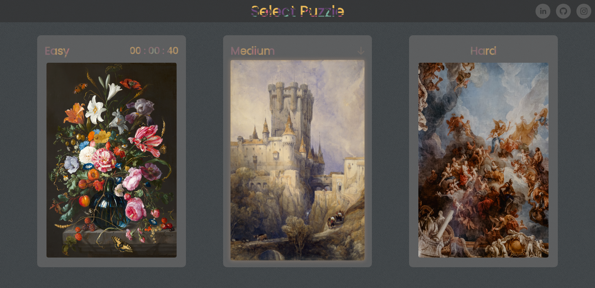
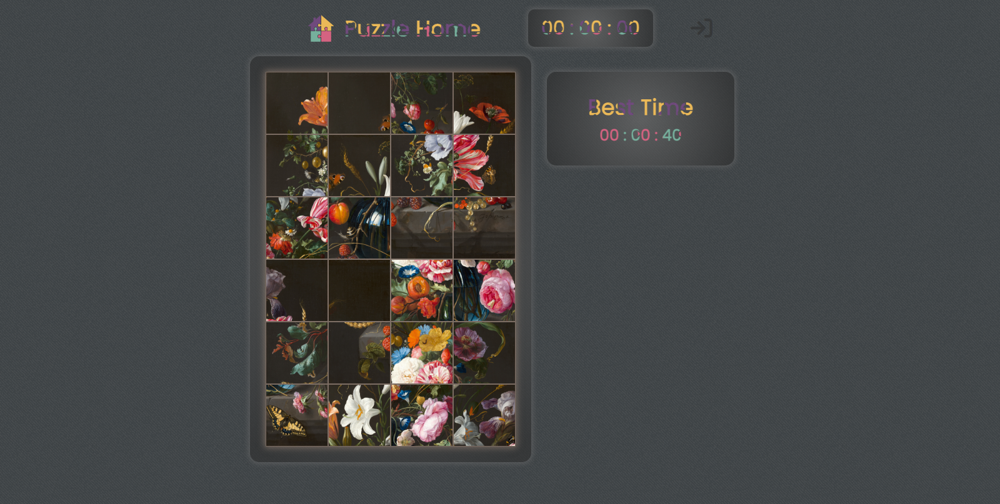

# Puzzle Home

Puzzle Home is an interactive web page that offers a collection of puzzles for users to enjoy and challenge their solving skills. The project is developed using React with TypeScript and makes use of several popular libraries and tools to provide a smooth and engaging user experience.

 

## Features

- Three puzzles of different difficulty levels to choose from: easy, medium, and hard.
- Individual timers for each puzzle, allowing users to compete with themselves and improve their time.
- History of the user's best time achieved for each puzzle.
- Intuitive and appealing user interface.
- Drag and drop puzzle piece functionality using the React Dnd-kit library.
- Page navigation using React Router for a seamless user experience.

## Technologies Used

- <a href="https://react.dev/" target="_blank">**React**</a>: A JavaScript library for building interactive user interfaces.
- <a href="https://www.typescriptlang.org/docs/" target="_blank">**TypeScript**</a>: A superset of JavaScript that adds static types and other features to the language syntax.
- <a href="https://sass-lang.com/documentation/" target="_blank">**Sass**</a>: A CSS preprocessor that provides additional features and a more readable syntax.
- <a href="https://docs.dndkit.com/" target="_blank">**React Dnd-kit**</a>: A library that makes implementing drag and drop functionality in React easier.
- <a href="https://reactrouter.com/en/main" target="_blank">**React Router**</a>: A library for managing routes and navigation in React applications.
- <a href="https://www.npmjs.com/package/react-social-icons" target="_blank">**react-social-icons**</a>: A library that offers a wide range of pre-defined social icons for use in the application.

## Project Structure

- `src/assets`: Contains static assets such as images and icons used in the application.
- `src/components`: Contains reusable components used in different parts of the application.
- `src/context`: Contains context providers and consumers used for state management.
- `src/data`: Contains data files used in the application.
- `src/models`: Contains TypeScript interfaces or types used for defining data structures.
- `src/pages`: Contains the main pages of the application.
- `src/styles`: Contains Sass style files for styling the application.
- `src/utilities`: Contains utilities and helper functions used in the application.

## Authors

- Matías Gonta

If you have any questions or concerns, feel free to contact me.
