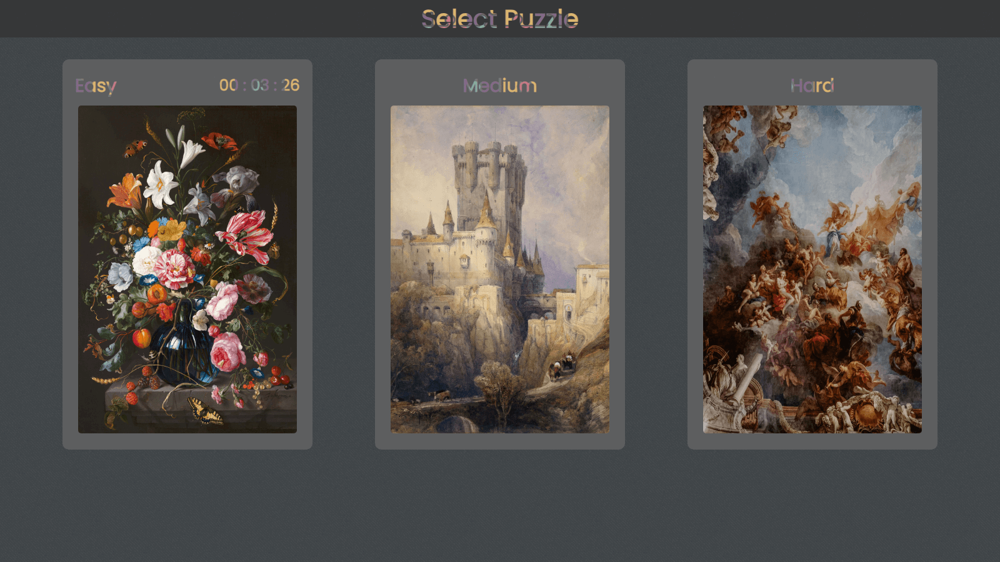

  

---

# Puzzle Home

Puzzle Home is a web page that offers a collection of puzzles for users to enjoy and challenge their solving skills. The project is developed using React with TypeScript and makes use of several popular libraries and tools to provide a smooth and engaging user experience.

You can <a href="https://youtu.be/4hoPhppO8EE" target="_blank">**click here**</a> to see an overview of the page.

## Features

- Three puzzles of different difficulty levels to choose from: easy, medium, and hard.
- Individual timers for each puzzle, allowing users to compete with themselves and improve their time.
- History of the user's best time achieved for each puzzle.
- Intuitive and appealing user interface.
- Drag and drop puzzle piece functionality using the React Dnd-kit library.

## Technologies Used

- <a href="https://react.dev/" target="_blank">**React**</a>: A JavaScript library for building interactive user interfaces.
- <a href="https://www.typescriptlang.org/docs/" target="_blank">**TypeScript**</a>: A superset of JavaScript that adds static types and other features to the language syntax.
- <a href="https://sass-lang.com/documentation/" target="_blank">**Sass**</a>: A CSS preprocessor that provides additional features and a more readable syntax.
- <a href="https://docs.dndkit.com/" target="_blank">**React Dnd-kit**</a>: A library that makes implementing drag and drop functionality in React easier.
- <a href="https://reactrouter.com/en/main" target="_blank">**React Router**</a>: It is a library for declarative and dynamic navigation in React applications, allowing the management of routes and views efficiently.

## Project Structure

- `src/assets`: Contains static assets such as images and icons used in the application.
- `src/components`: Contains reusable components used in different parts of the application.
- `src/context`: Contains context providers and consumers used for state management.
- `src/data`: Contains data files used in the application.
- `src/fonts`: Stores used fonts locally throughout the application, ensuring efficient and consistent loading.
- `src/models`: Contains TypeScript interfaces or types used for defining data structures.
- `src/pages`: Contains the main pages of the application.
- `src/styles`: Contains Sass style files for styling the application.
- `src/utilities`: Contains utilities and helper functions used in the application.

## Authors

- Matías Gonta

If you have any questions or concerns, feel free to contact me.

---

  

---

# Puzzle Home

Puzzle Home es una página web que ofrece una colección de rompecabezas para que los usuarios disfruten y desafíen sus habilidades de resolución. El proyecto se desarrolla utilizando React con TypeScript y utiliza varias bibliotecas y herramientas populares para brindar una experiencia de usuario fluida y atractiva.

Puedes hacer <a href="https://youtu.be/4hoPhppO8EE" target="_blank">**click aquí**</a> para ver una visión general de la aplicación en acción.

## Características

- Tres rompecabezas de diferentes niveles de dificultad para elegir: fácil, medio y difícil.
- Temporizadores individuales para cada rompecabezas, lo que permite a los usuarios competir consigo mismos y mejorar su tiempo.
- Historial del mejor tiempo logrado por el usuario para cada rompecabezas.
- Interfaz de usuario intuitiva y atractiva.
- Funcionalidad de arrastrar y soltar piezas de rompecabezas usando la biblioteca React Dnd-kit.

## Tecnologías utilizadas

- <a href="https://react.dev/" target="_blank">**React**</a>: Una biblioteca de JavaScript para crear interfaces de usuario interactivas.
- <a href="https://www.typescriptlang.org/docs/" target="_blank">**TypeScript**</a>: Un superconjunto de JavaScript que agrega tipos estáticos y otras funciones a la sintaxis del lenguaje.
- <a href="https://sass-lang.com/documentation/" target="_blank">**Sass**</a>: Un preprocesador de CSS que proporciona funciones adicionales y una sintaxis más legible.
- <a href="https://docs.dndkit.com/" target="_blank">**React Dnd-kit**</a>: Una biblioteca que facilita la implementación de la funcionalidad de arrastrar y soltar (drag and drop) en React.
- <a href="https://reactrouter.com/en/main" target="_blank">**React Router**</a>: Es una biblioteca para la navegación declarativa y dinámica en aplicaciones React, permitiendo la gestión de rutas de manera eficiente.

## Estructura del proyecto

- `src/assets`: Contiene activos estáticos como imágenes e íconos utilizados en la aplicación.
- `src/components`: Contiene componentes reutilizables utilizados en diferentes partes de la aplicación.
- `src/context`: Contiene proveedores de contexto y consumidores utilizados para la gestión del estado.
- `src/data`: Contiene archivos de datos utilizados en la aplicación.
- `src/fonts`: Almacena las fuentes utilizadas localmente en toda la aplicación, lo que garantiza una carga eficiente y consistente.
- `src/models`: Contiene interfaces o tipos de TypeScript utilizados para definir estructuras de datos.
- `src/pages`: Contiene las páginas principales de la aplicación.
- `src/styles`: Contiene archivos de estilo Sass para diseñar la aplicación.
- `src/utilities`: Contiene utilidades y funciones auxiliares utilizadas en la aplicación.

## Autores

- Matías Gonta

Si tiene alguna pregunta, inquietud o interés, no dude en ponerse en contacto conmigo.